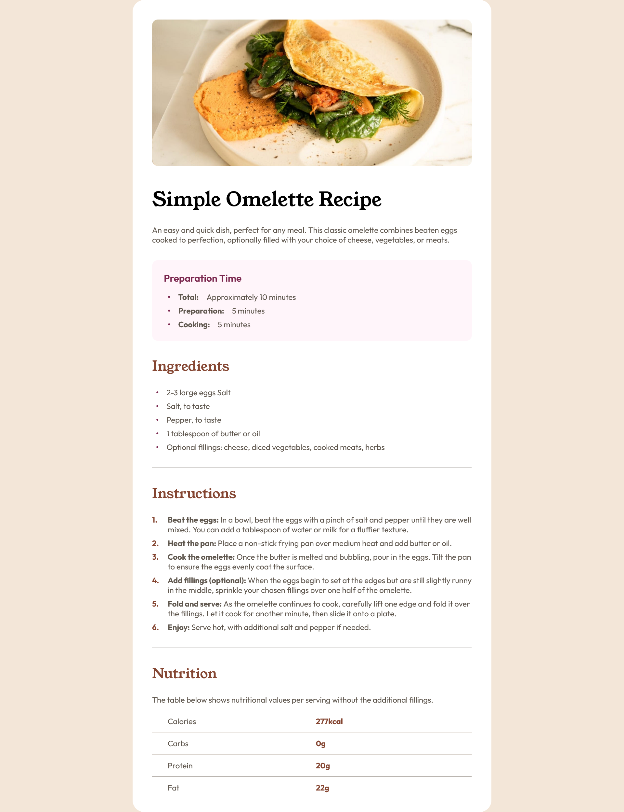

# Frontend Mentor - Recipe page solution

This is a solution to the [Recipe page challenge on Frontend Mentor](https://www.frontendmentor.io/challenges/recipe-page-KiTsR8QQKm). Frontend Mentor challenges help you improve your coding skills by building realistic projects. 

## Table of contents

- [Overview](#overview)
  - [The challenge](#the-challenge)
  - [Screenshot](#screenshot)
  - [Links](#links)
- [My process](#my-process)
  - [Built with](#built-with)
  - [What I learned](#what-i-learned)
  - [Continued development](#continued-development)

## Overview

### Screenshot

### Links

- Solution URL: [Add solution URL here](https://github.com/vishpant76/recipe-page)
- Live Site URL: [Add live site URL here](https://vishpant76.github.io/recipe-page/)

## My process

### Built with

- Semantic HTML5 markup
- CSS properties
- Flexbox

### What I learned

- Using flexbox to design nested layouts.

- How to set a custom counter using CSS to override bullet style lists to something different such as a numbered list.

### Continued development

- Need more practice on styling sections or components when list items are involved.
- A better way to write and style line breaks instead of using `
`. Should've used border instead but I was having trouble with how to use it inside flexbox with the other flex items so settled with `
` for now.
- Keep the CSS more structured and organized by relying on inheritance and grouping selectors when possible.
- Learn more about applying position property to elements.
- Still not very comfortable with flex-item properties so it needs more attention in future projects.